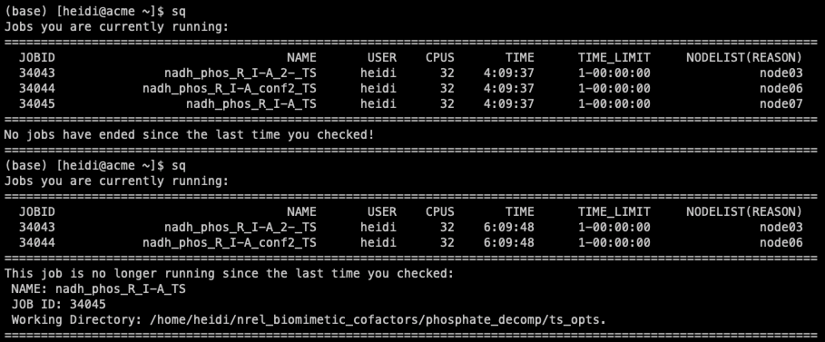

Slurm Job Tracking
------------------

A Python script that will allow you to track completion of slurm jobs. Especially useful if you are running numerous jobs in numerous locations. 

To install and use:

* Copy jobcheck.py to machine
    - You can copy the file anywhere; I chose my home directory.
    
* (optional) Add alias to your .bashrc >> alias sq 'python ~/jobcheck.py'
* Run command
    - When you run for the first time, the script initializes and logs current job information.
    - Note you should run the command everytime aftet you submit jobs, or else it won't log current job info.   
    
This is what it looks like when you run the command and a job has ended since the last time the command was run:

Future Additions
----------------
If you have any ideas please let me know!
- Email triggers
- Functionality across multiple machines to log and track all jobs
